[AWS THREE TIER APPLICATION ARCHITECTURE DOCUMENTATION]{.underline}.\
\
This document provides directions on how to build the three-tier
application architecture using AWS services which upholds the six
pillars in the AWS well architectured framework.

Let's begin with a high-level diagram of the architecture.

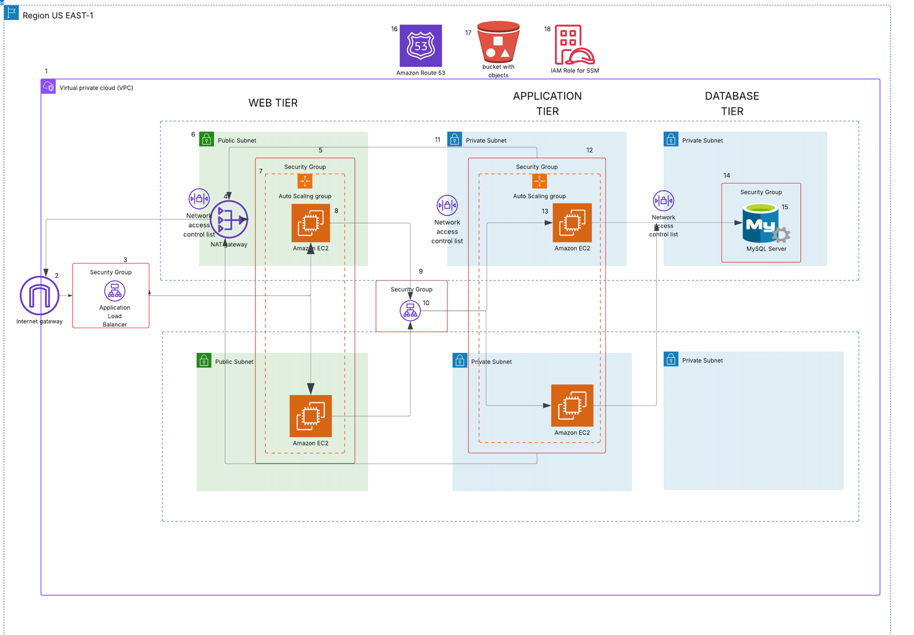{width="6.950609142607174in"
height="4.8367793088363955in"}

- From the diagram above, the resources needed for the project include:

- Virtual Private Cloud (VPC)

- Internet Gateway

- Application Load Balancer

- Elastic Compute Service (EC2)

- RDS Database (Mysql)

- NAT Gateway

- Auto-scaling groups

- Security Groups

- Simple Storage (s3)

- Route 53

- Identity Access Management (IAM)

[Project Objectives and Deliverables:]{.underline}

• VPC Architecture Diagram: A detailed diagram showing the VPC layout,
subnets, route tables, and other networking components.

• VPC Configuration: Setup and configuration details of subnets, route
tables, and NAT gateways.

• Documentation of network security measures (ACLs, security groups).

Auto-Scaling and Load Balancing Setup: Auto-scaling policies and
configurations with usage thresholds. Load balancer configuration,
including health check setups and listener rules.

• Database Integration: Database instance setup, including subnet
configuration and security group rules

Connection configurations between the application layer and database.

• Security Documentation: List of IAM roles and policies used, along
with their permissions.

Security group and ACL configurations for different components.

• Project Report and Presentation: A comprehensive report detailing the
architecture, challenges, solutions, and outcomes, along with a
presentation for final evaluation.

[APPLICATION TIERS]{.underline}

*Web Tier*

*The Web Tier is the user interface and the communication layer of the
application. This is*

*where the end user will interact with the application. It will display
information and collect*

*information.*

Application Tier

The logic or the application tier is the heart of the architecture, it
is where information is

processed. This tier includes all the business logic used to process
inputs. It can direct queries, do Api calls, process in for mation and
commands, make logical decisions, perform calculations. It moves and
processes information to the other layers.

Database Tier

This is where information will be stored and managed

Let's Dive into procedure in building the architecture

The application code is in the git hub repo below, clone it to your
local space

GitHub URL: https://github.com/bignate8735/aws-3tier-app-architecture

[Building Infrastructure]{.underline}

1\. VPC Creation

Design and create a Virtual Private Cloud (VPC) to serve as the
foundation for the project infrastructure.

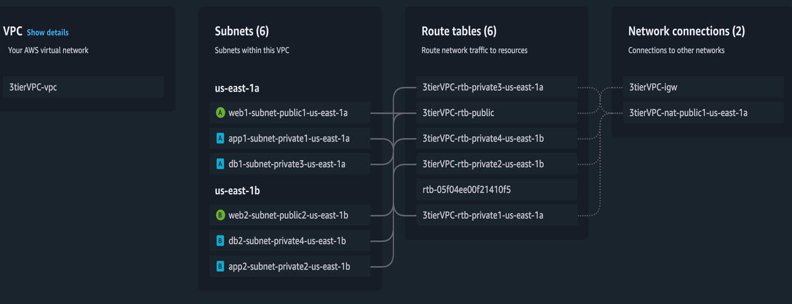{width="6.482379702537183in"
height="2.498611111111111in"}

2\. S3 Bucket and IAM Role for SSM Setup

[Create an S3 bucket and upload the application
code.]{.underline}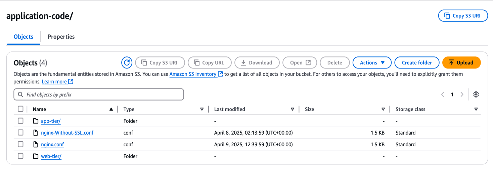{width="6.558182414698162in"
height="2.3279997812773403in"}

[Set up an IAM role with the necessary permissions and attach it to the
EC2 instance, create an ec2 role for
ssm]{.underline}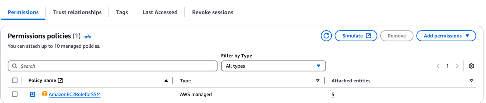{width="6.268055555555556in"
height="1.3368055555555556in"}

[Setup Security Groups -- In this project there are five of
them]{.underline}

- web-tier-SG

- app-SG

- db-SG

- external-ALB-SG

- internal-ALB-SG

[security groups]{.underline}

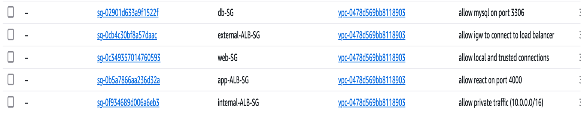{width="6.889733158355206in"
height="1.3677340332458443in"}

[Let configure the inbound rules for each security group.]{.underline}

[web-tier-SG:]{.underline}

Allow HTTP traffic from the external application load balancer
(external-ALB-SG) on port 80

Allow HTTP traffic from the VPC network (eg.10.0.0.0/16) on port 80

[app-tier-SG]{.underline}

Allow custom TCP from VPC network (eg.10.0.0.0/16) on port 4000

Allow HTTP traffic from the VPC network (eg.10.0.0.0/16) on port 80

[Db-tier-SG]{.underline}

Type: Mysql/Aurora on TCP protocol on port 3306 from source VPC network
( (10.0.0.0/16)

[external-ALB-SG]{.underline}

Allow HTTP traffic from any IPV4 (0.0.0.0/0) on port 80

[Internal-ALB-SG]{.underline}

Allow HTTP traffic from VPC network (eg.10.0.0.0/16) on port 80

[Network Access Control List Nacls]{.underline}

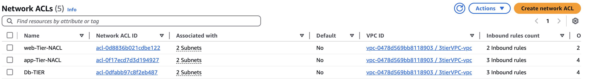{width="6.268055555555556in"
height="1.8720002187226596in"}

3\. [Database Configuration]{.underline}

Launch and configure an RDS instance (mysql) to serve as the backend
database.

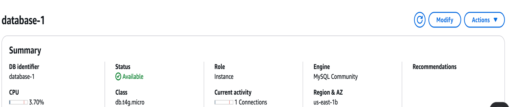{width="6.268055555555556in"
height="1.3279997812773403in"}

[Application Tier Setup]{.underline}

Deploy application-tier resources, including the configuration of the
connection to the my sql database. Install mysql client then connect.

[Configuring Database connection.]{.underline}

In this instance we will do the App Server Setup and DB Server
Configuration. Execute the below commands;

Install MySQL

sudo yum install mysql -y

[Configure MySQL Database]{.underline}

Connect to the database and perform basic configuration: Replace below
info with your DB information

mysql -h \<DB EndPoint\> -u admin -p

Enter the Password i.e 'azubiafrica' (this is DB password). If you
couldn\'t connect, there is a problem with the SG of the DB.

Ex: mysql -h database-1.c380a08uukyc.ap-south-1.rds.amazonaws.com -u
admin -p

Let's create a database. The database name is \"webappdb\" (This is same
name that you should give in DvConfig.js file);

CREATE DATABASE webappdb;

SHOW DATABASES;

USE webappdb;

You will see \'Database changed\'

Execute the below code as a single code. Here we are creating a table
with the name \'transactions\'

CREATE TABLE IF NOT EXISTS transactions(

id INT NOT NULL AUTO_INCREMENT,

amount DECIMAL(10,2),

description VARCHAR(100),

PRIMARY KEY(id)

);

To verify whether table got created or not;

SHOW TABLES;

Lets insert some info into the table:

INSERT INTO transactions (amount, description) VALUES (\'400\',
\'groceries\');

To verify whether the entry is really created or not

SELECT \* FROM transactions;

You will see the info you have written

To come out of the DB;

exit

(You will see \'ec2-user\' at the end of command line and at the
beginning of command line you will see \'root\')

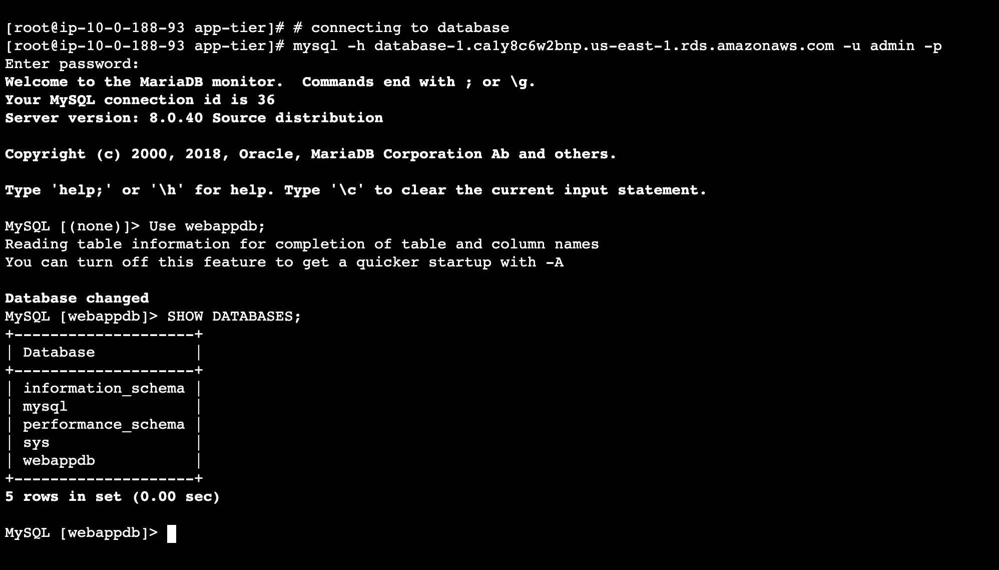{width="6.268055555555556in"
height="3.573611111111111in"}

App-tier configuration (backend)

Go into the following path of cloned code
\"application-code/app-tier/DbConlslfig.js\" and open \'Dbconfig.js\'
file and change the things accordingly as shown below;

module.exports = Object.freeze({

DB_HOST: \'YOUR-DATABASE-ENDPOINT.ap-south-1.rds.amazonaws.com\',

DB_USER: \'admin\',

DB_PWD: \'azubiafrica',

DB_DATABASE: \'webappdb\'

});

The reason for having the above info is our App Servers running in
Private Subnets should be able to connect to the DB, for that
connectivity it is going to use these credentials provided in
DbConfig.js file.

Update the above code and upload the Dbconfig.js file in the S3 bucket
of \'app-tier\' folder.

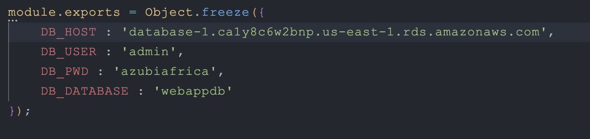{width="6.268055555555556in"
height="1.4902777777777778in"}

In the app-tier resource follow these steps and configure the following:

Node.js Configuration

Install and Configure Node.js and PM2

curl -o-
https://raw.githubusercontent.com/avizway1/aws_3tier_architecture/main/install.sh
\| bash

source \~/.bashrc

nvm install 16

nvm use 16

(You will see \'Now using node v16.20.2)

NVM means Node Version Manager

To run node as a service, we will install pm2

npm install -g pm2

(You will see \'found 0 vulnerabilities)

Download application code from S3 and start the application

cd \~/

sudo aws s3 cp s3://\<S3BucketName\>/application-code/app-tier/ app-tier
\--recursive

Ex: sudo aws s3 cp s3://demo-3tier-project/application-code/app-tier/
app-tier \--recursive

ls

You will see \'app-tier\' folder

cd app-tier/

npm install

ls

You will see \'index.js\' file. We have to start that.

pm2 start index.js

(You will see the status as \'online\')

To verify;

pm2 list (or) pm2 status

pm2 logs (You will not see anything in red colour, everything in white
colour you should see)

At the end you will see something like; http://localhost:4000

pm2 startup

pm2 save \-\--\> To save the configuration

Verify that the application is running by executing

curl http://localhost:4000/health

It should return: This is the health check.

With this we have completed the application configuration.

[Creation of Internal Load Balancer and Target groups for App
Tier]{.underline}

App Target Group

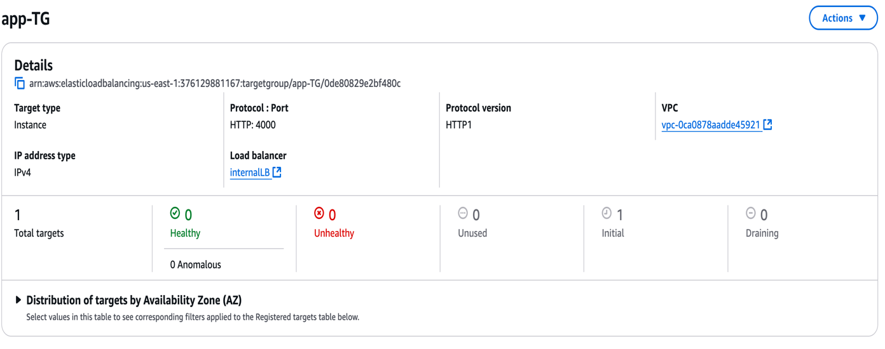{width="6.268055555555556in"
height="2.48in"}

Internal Load Balancer

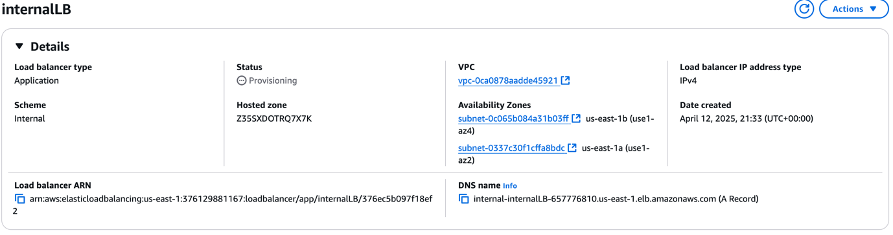{width="6.268055555555556in"
height="1.6590277777777778in"}

Go to the downloaded code folder in local system \-\-\--\> Open
nginx.conf file and in the end of the file you will see something like
below;

#proxy for internal lb

location /api/{

proxy_pass http://\[REPLACE-WITH-INTERNAL-LB-DNS\]:80/;

}

Replace the LB DNS in the above

Upload the updated nginx.conf file to the S3 bucket

This one we are going to copy to the webserver in sometime.

Creation of Web tier resources including External Load Balancer

sudo -su ec2-user (To work as an ec2-user)

cd /home/ec2-user

curl -o-
https://raw.githubusercontent.com/avizway1/aws_3tier_architecture/main/install.sh
\| bash

source \~/.bashrc

nvm install 16

nvm use 16

aws s3 cp s3://\<S3 Bucker Name\>/application-code/web-tier/ web-tier
--recursive

Ex: aws s3 cp s3://demo-3tier-project/application-code/web-tier/
web-tier \--recursive

ls \-\-\--\> You will see \'web-tier\'

cd web-tier

npm install

npm run build

sudo amazon-linux-extras install nginx1 -y

Update Nginx configuration:

cd /etc/nginx (You are in nginx path)

ls \-\-\--\> You will see \'nginx.conf\' file

sudo rm nginx.conf

Ex: sudo aws s3 cp s3://demo-3tier-project/application-code/nginx.conf .

sudo service nginx restart

chmod -R 755 /home/ec2-user

sudo chkconfig nginx on

To check the output of the App, we can check using the Web-Tier-Instance
public IP. But before checking lets open port no 80 with http, Anywhere
IPv4, 0.0.0.0/0 \-\--\> Save rules \-\-\--\> Now paste the pubic ip of
Web-Tier-Instance in new tab of browser

You will see the app

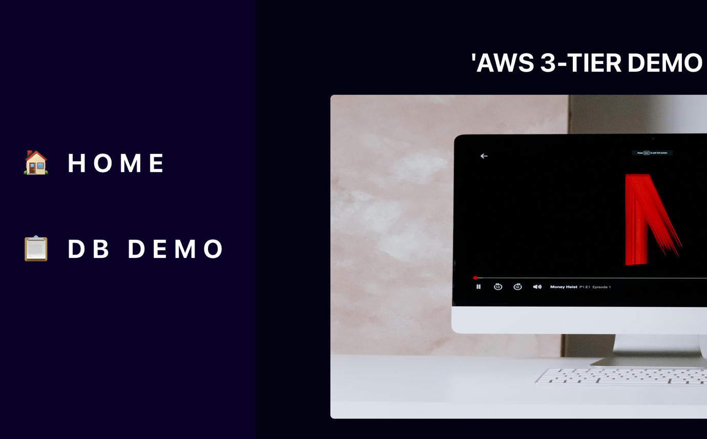{width="6.268055555555556in"
height="3.8958333333333335in"}

Enter data in the app

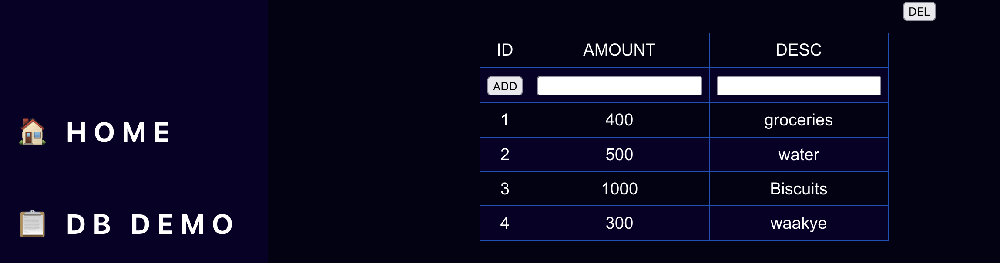{width="6.267485783027122in"
height="2.936000656167979in"}

This Data Can now be viewed from the backend. Connect to the Ec2
instance of the app tier via ssm, connect to the database endpoint.

Input the query

SELECT \* FROM transactions;

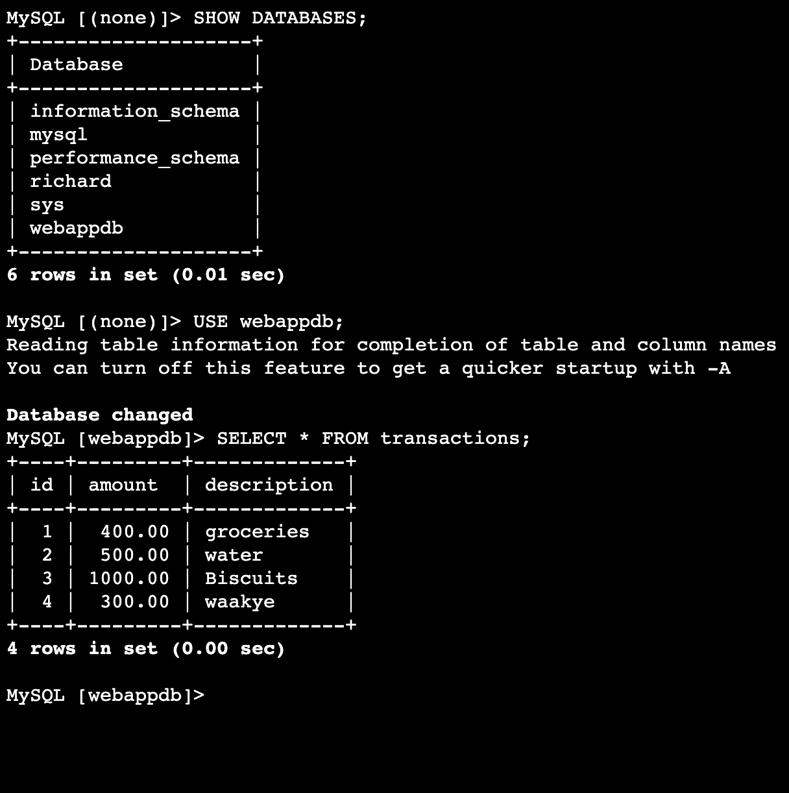{width="6.268055555555556in"
height="6.299305555555556in"}

As you can see, the data has successfully registered in the database.

External Load Balancer

Target Group

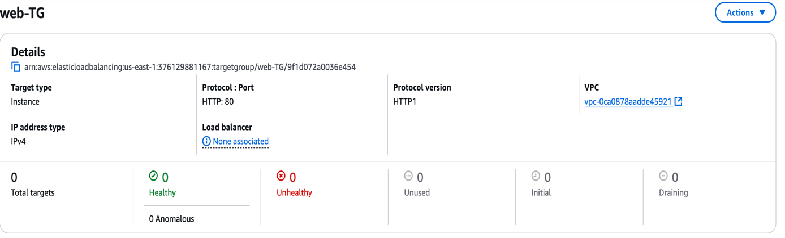{width="6.268055555555556in"
height="1.9119991251093613in"}

External Load Balancer

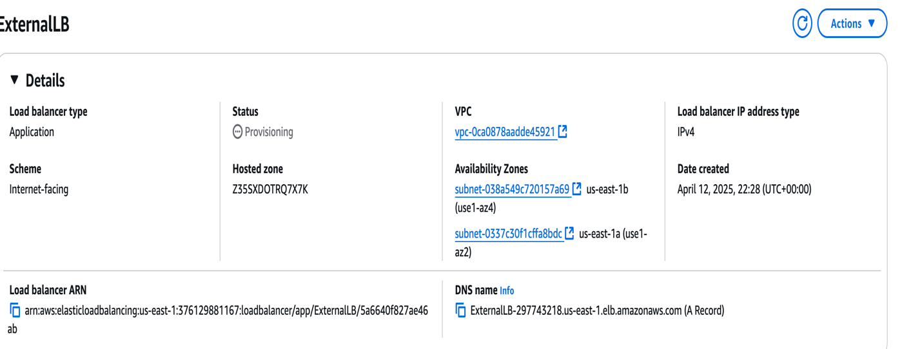{width="6.268055555555556in"
height="2.4240004374453195in"}

Auto-Scaling Groups

Web-tier-ASG

First Build an AMI Image from the configured instance in the web tier.

Make a launch template including the AMI.

AMI Image

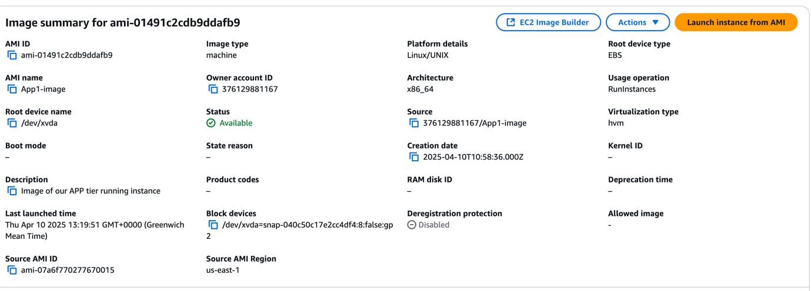{width="6.268055555555556in"
height="2.254861111111111in"}

Launch Template

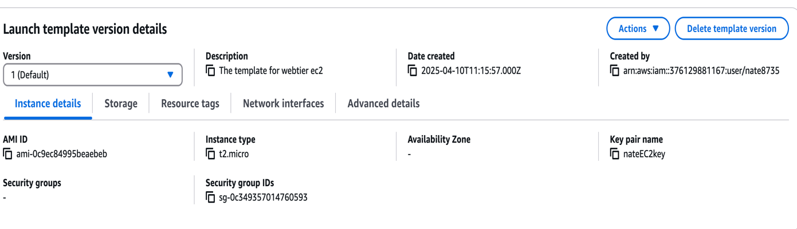{width="6.268055555555556in"
height="1.8in"}

{width="6.828313648293963in"
height="5.207638888888889in"}

*The components in the Architecture are labelled from 1 to 18, each
components role is below:*

*1. VPC*

*Virtual Private Cloud- contains six subnets, two of which are public
and*

*four private. Network address (10.0.0.0/16)*

*Contains an internet-gateway and a NAT gateway with an elastic IP*

*2. Internet gateway -- Recievcing and directing traffic from and to the
internet.*

*3. External Application load Balancer -- Directing traffic between the
EC2 instances in the plublic*

*subnet. The security group attached to this load balancer is to allow
HTTP traffic from any IPV4*

*network(0.0.0.0/0)*

*4.NAT gateway -- Situated in the public subnet routes traffic through
the NAT gateway, which*

*masks the masks the IP's of the instances in the private subnet with a
public IP, enabling access out*

*of the internet.*

*5. Security group of the Ec2 instances in the public subnet, which is
configured to allow http traffic*

*from both external load balancer and the network of the VPC
(10.0.0.0/16)*

*6.Public Subnet -- Has direct connectivity to the internet gateway and
houses the EC2 instance*

*running the frontend of the web application.*

*7.Auto-scaling group of the web tier instances, configured to deploy a
maximum of two instances*

*when load on the cpu goes above 70 percent.*

*8. Web tier EC2 instance -- runs the landing page of the application
which which allows everyone to*

*have access to the webpage.*

*9. Internal Load Balancer -- This load balancer directs traffic to the
instances created in the private subnet. The security*

*group attached to it allows inbound HTTP tracffic from the VPC network
(10.0.0.0/16)*

*11. Private Subnet -- The private subnet was used to house instance
where direct internet connection to the gateway was*

*prohibited. All inbound and outbound traffic is routed through the NAT
gateway.*

*13 Security Group for instances in private subnet -- This security
group only allowd HTTP traffic from the VPC network*

*(10.0.0.0/16) on port 80 and also HTTP traffic from the vpc network on
port 4000. Port 4000 is the port the react*

*application running in the App tier instance listens on.*

*14. Security Group for Database instance- The allowed tracffic of type
mysql/aurora from the internal VPC network*

*(10.0.0.0/16) on port 3306*

*15. Database- The database is a mysql database server with a webappdb
database where all data recorded on the web*

*application is stored. The webpage allows you to list a number of items
purchased and their prices.*

*16.Route 53 -- Configured a domain name for our public IP of the web
page so end users can easily remember and log on.*

*17 S3 Bucket -- The config files and application code is stored in an
s3 bucket, which continues integrates changes to the*

*app, when local changes are integrated.*

*18.IAM Role -- The IAM role is an AmazonEC2RoleforSSM is associated
with the Ec2 instances in the private subnet to allow*

*it ability to communicate with AWS resources like s3, where the
application code and files is stored.*

*[Cost Optimization and Forecasting]{.underline}*

*The Architecture was run for 3 days, with the help of cost explorer, we
get an idea of how much it would cost monthly when this infrastructure
is used by an organization for their business*

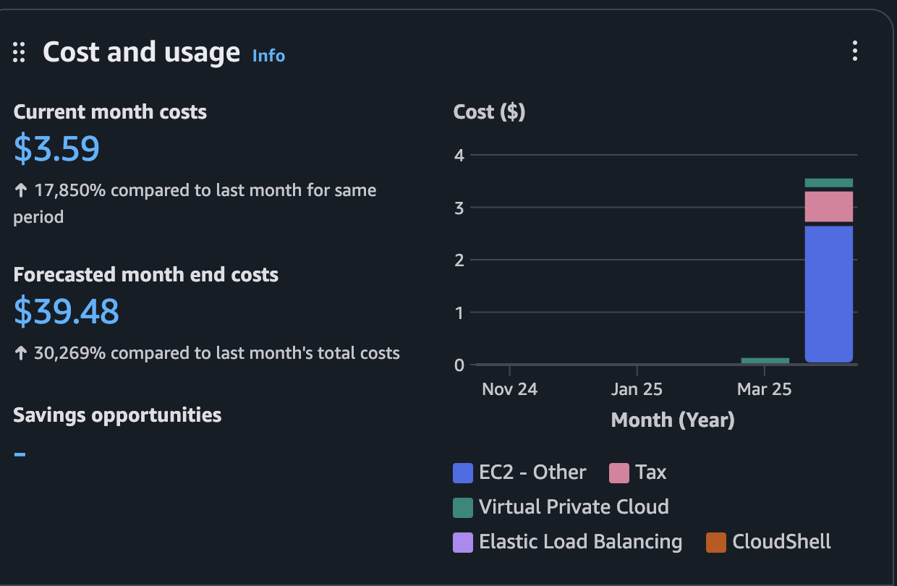{width="6.268055555555556in"
height="4.094444444444444in"}

*[Challenges, Observations and Final Thoughts]{.underline}*

*Challenges:*

*• Managing Consistency Across Instances*

*One of the biggest challenges was ensuring that the latest version of
the web tier files, stored in S3, were always reflected in the EC2
instances---especially during auto scaling events. Newly launched
instances needed to be automatically updated,which required automation
with user data scripts or AMIs.*

*• Security Rules with NACLs and Security Groups*

*Configuring NACLs for different tiers (Web, App, DB) introduced
complexity, especially when working with ephemeral ports. Ensuring rules
didn't conflict and all necessary ports were open for both inbound and
outbound traffic across tiers was tricky and required in-depth testing.*

*• Subnet Management for High Availability*

*Allocating subnets in different availability zones for redundancy while
ensuring correct routing and rule application was a learning curve.
Balancing between route tables, NACLs, and ensuring each tier only
communicated with its intended counterpart was meticulous.*

*• Debugging Networking Issues*

*Troubleshooting failed EC2 connections to the RDS endpoint or S3
required checking everything from IAM roles to security groups to NACL
configurations.*

*[Observations]{.underline}*

*• Automation is Key*

*Using launch templates or AMIs with preconfigured code significantly
reduced setup time for EC2 instances in the Auto Scaling Group. It
ensures consistent deployment across new instances.*

*• NACLs Are Stateless but Powerful*

*Unlike security groups, NACLs are stateless, meaning both inbound and
outbound rules must be explicitly defined.*

*This offered an extra layer of network security but required precision
to avoid accidental blocking.*

*• The Role of NAT Gateways*

*The NAT Gateway was essential for allowing instances in private subnets
(like the App and DB tiers) to access the internet for updates or
external communications without exposing them to inbound internet
traffic.*

*• S3 as a Central Code Repository*

*Hosting web tier files on S3 made it easy to update the application,
but it's important to ensure that EC2 instances regularly fetch the
latest files, or use AMIs that already include them.*

*[Final Thoughts]{.underline}*

*• The three-tier architecture on AWS provided clear separation of
concerns---web, application, and data---which improves security,
scalability, and maintainability.*

*• Implementing NACLs enhanced understanding of network-level filtering
in contrast to instance-level security groups.*

*• I gained practical insights into auto scaling, load balancing, and
VPC networking, which are critical for building scalable and secure
cloud-based applications.*
